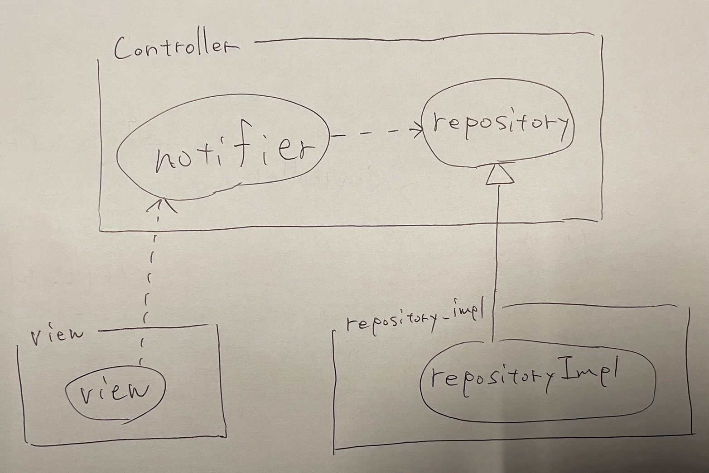

# github_repo_search

github_repo_search app for Android and possibly iOS

## 環境構築

### 使用しているツール等のバージョン

```shell-session
$ flutter --version
Flutter 3.19.3 • channel stable • https://github.com/flutter/flutter.git
Framework • revision ba39319843 (9 days ago) • 2024-03-07 15:22:21 -0600
Engine • revision 2e4ba9c6fb
Tools • Dart 3.3.1 • DevTools 2.31.1

$ fvm --version
3.0.13
```

### .envの準備

内部でGitHubのPersonal access tokensを利用しています。
トークンは[github.com](https://github.com/settings/personal-access-tokens/new)から作成できるFine-grained tokensを使っています。
`Repository access`は`Public Repositories (read-only)`、`Permissions`は全て`No access`で問題ありません。
dotenvで読み取っているため、以下の内容の.envを作成してください。

```.env
GITHUB_TOKEN=<your token here>
```

### その他の準備

```shell-session
# fvmを使用している場合、.fvmrcを利用して設定が可能です
$ fvm install

# パッケージ取得
$ fvm flutter pub get
```

### 実行

```shell-session
# 実行
$ fvm flutter run
```

なお、vscodeを利用している場合はlaunch.jsonから起動することも可能です。

### テスト

```shell-session
$ fvm flutter test

# 疎通テストは以下の通り。ネットワーク越しでも問題なく動くことを確認したいときのみ使用するため、基本的には使わない。
$ fvm flutter test manual_test
```

## 構成

以下のような構成になっています。

```bash
controller/             # viewから呼び出されるProvider類と、それが利用するRepositoryのinterface
model/                  # 各種オブジェクト
repository_impl/        # controller/repositoryの実装クラスとそのProvider
util/                   # 汎用的に使う関数など
view/                   # UI部分
    page/                   # 一つの画面に相当する
    component/              # 画面より小さい単位のウィジェット
main.dart               # エントリポイント
```

それぞれの依存関係は以下のようなイメージです。
- 各`RepositoryImpl`は`controller/`配下にある`Repository`を実装し、riverpod経由で`RepositoryImpl`ではなく`Repository`としてそれらを公開します。
- `controller/`配下の各`Notifier`は、`Repository`に依存します。
- `view/`配下の各コンポーネントは`controller/`配下にある各`Notifier`を適宜参照します。



## ブランチ運用・リリース

github flowを採用しています。
作業を行う際はmainからfeatureブランチを切り、基本的にプルリクエストのみによってmainブランチが更新されます。
タグを切るとAndroid版のapkが作成され、GitHub ActionsのArtifactsに保存されます。

## CI/CD

CIが設定しており、`dart format .`によるフォーマットの確認、`flutter analyze`によるプロジェクトの解析、`flutter test`によるテストの実行が行われます。
mainブランチへのpushが発生したタイミング、mainブランチへのプルリクエストに対して行われます。

CDに関してはブランチ運用・リリースの通りですが、タグを切るとAndroid版のapkが作成され、GitHub ActionsのArtifactsに保存されます。
